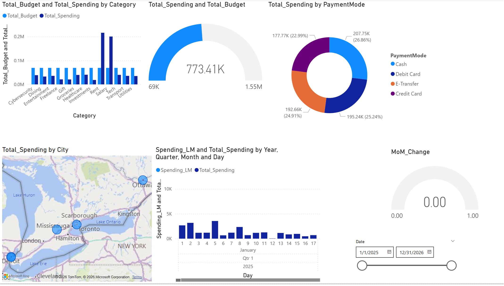

# 📊 Personal Finance Intelligence Dashboard
**Building a Scalable Financial Command Center with Python & Power BI**

 
*Note: Replace this with your own high-res screenshot or a GIF of the dashboard in action!*

---

## 🎯 Project Objective
Most expense trackers are static snapshots. This project's goal was to build a **Relational Financial Engine** that doesn't just show *what* was spent, but analyzes *performance against targets* and *trends over time*. 

This dashboard serves as a professional portfolio piece demonstrating a full data lifecycle: from synthetic data generation in Python to complex relational modeling and DAX-driven insights in Power BI.

---

## 🛠️ Technical Stack
* **Data Engineering:** Python (`pandas`, `numpy`) for generating 2,500+ randomized transactions.
* **Data Modeling:** Star Schema architecture with a centralized Dim_Date table.
* **Analytics:** Advanced DAX (Time Intelligence, Variance Analysis, Conditional Formatting).
* **Visualization:** Power BI Desktop with custom tooltips and geographic mapping.

---

## 🧠 The Architecture: Star Schema
To move away from "flat-file" limitations, I implemented a professional Star Schema. This allows the dashboard to scale and handle multiple fact tables (Actuals vs. Budgets) effortlessly.

* **Fact_Actuals:** Daily transaction records with Merchant and Payment Mode details.
* **Fact_Budget:** Monthly spending targets per category.
* **Dim_Date:** A dedicated calendar table enabling "Time Travel" calculations.

---

## 🚀 Key Analytical Features

### 1. The "Red Alert" Variance System
I implemented conditional formatting rules based on a custom DAX measure: 
`Budget_Variance = [Total_Spending] - [Total_Budget]`
Categories turn **Red** automatically when spending exceeds the limit, providing immediate visual feedback on financial health.

### 2. Time Intelligence (The Master Clock)
Used DAX to track financial momentum across months:
* **Spending Last Month (LM):** `CALCULATE([Total_Spending], DATEADD('Dim_Date'[Date], -1, MONTH))`
* **MoM % Change:** Identifies if spending habits are improving or declining relative to the previous period.

### 3. Geographic Intelligence
Resolved common Bing Maps "Mapping Drift" (where London, Ontario defaults to London, UK) by engineering explicit location strings within the Python generation script. The map now accurately reflects spending hubs in **Windsor, Toronto, Detroit, and Kitchener**.

---

## 📂 Project Structure
* `scripts/`: Contains `datagenerator.py` used to build the synthetic dataset.
* `data/`: CSV exports used as the data source for Power BI.
* `report/`: The `.pbix` file containing the visuals and DAX logic.
* `images/`: High-resolution screenshots for documentation.

---

## 📈 Future Roadmap: Iteration 3
The next phase of this project involves **Data Pipeline Automation**:
- [ ] Transitioning the backend from flat CSVs to a live **SQL Database**.
- [ ] Automating the data injection using Python to simulate real-time transaction logging.
- [ ] Implementing **DirectQuery** for live dashboard updates.

---

## 🔗 How to Reproduce
1. Clone this repository.
2. Run `python scripts/datagenerator.py` to populate the `data/` folder.
3. Open the `Finance_Dashboard.pbix` file.
4. Hit **Refresh** to see the model ingest the generated data.

**Connect with me on [LinkedIn]([YOUR_LINKEDIN_URL_HERE](https://www.linkedin.com/in/joelroy393/)) to discuss data analytics and BI!**
